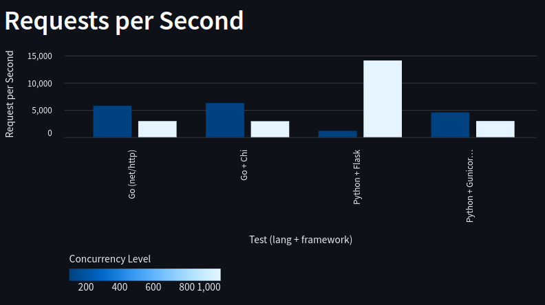
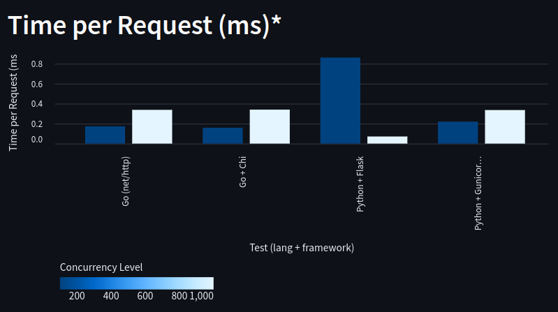
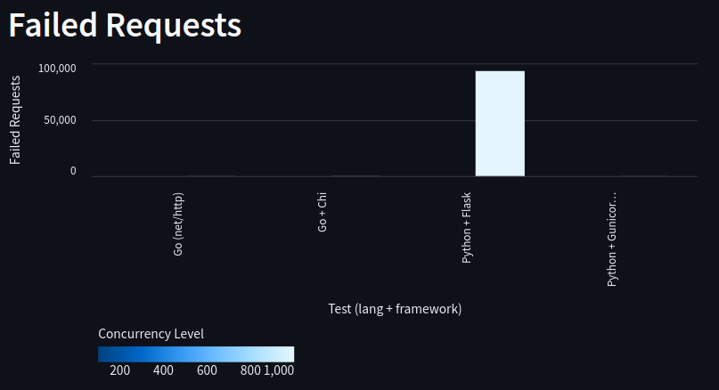
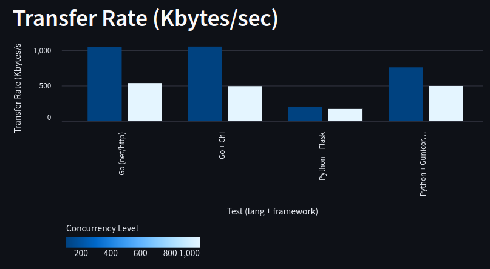

# API_Bench
A Simple Benchmark using Go, Python, Nginx and Docker.

This test is a subject of study for the Go language and the use of Docker and Nginx. It was conducted in a local environment and serves as an initial demonstration, with further testing needed using different types of responses and monitoring CPU/memory load.


## Results

Based on the data provided, we can draw the following conclusions regarding the performance of different frameworks and configurations:

1. **Overall Performance**
Go (net/http) and Go + Chi demonstrate high performance, with a high number of requests per second (RPS) and fast response times. Python + Flask shows the poorest performance, with RPS 80% lower than Go and 93.22% request failures under heavy load. Python + Gunicorn + Flask significantly improves performance, approaching Go in high concurrency scenarios.


2. **Throughput (Requests per Second)**
Go + Chi achieves the highest RPS with 100 concurrent requests. Gunicorn enhances RPS in Python, but Go still leads. At higher concurrency levels (1000), Go remains robust, while Python with Gunicorn gets closer.




3. **Time per Request**
Go, with both net/http and Chi, maintains consistently low response times, indicating greater efficiency. Python without Gunicorn has high response times, while Python + Gunicorn significantly reduces these times, though still trailing behind Go in low concurrency and approaching in high concurrency.




4. **Request Failures**
Go shows few or no request failures, even under heavy load. Python + Flask has a high number of failures at high concurrency, indicating low scalability without Gunicorn.




5. **Transfer Rate**
Go leads in transfer rate, showing higher efficiency in data transmission. Python + Flask again underperforms, with some improvement when using Gunicorn.




6. **Response Time Percentiles**
Go and Go + Chi have low and consistent percentiles, indicating quick responses. Python + Flask without Gunicorn has high percentiles, indicating variability and significant slowdowns under load. Python + Gunicorn improves this but still shows outliers compared to Go.

**General Conclusions**
Go is superior in terms of performance, scalability, and reliability, handling high concurrency well. Python + Flask without Gunicorn is not suitable for high loads, but the introduction of Gunicorn improves performance. Go is ideal for critical applications that require high performance, while Python + Flask + Gunicorn is more suitable for less demanding scenarios.
These tests were conducted in a local environment and serve as an initial demonstration, with further testing needed using different types of responses and monitoring CPU/memory load.


## Contributing

Your contributions are welcome! If you encounter any bugs or have feature requests, please open an issue. To contribute code, follow these steps:

1. Fork the repository.
2. Clone your forked repository to your local machine.
3. Create a new branch (git checkout -b feature-or-bugfix-name).
4. Make your changes and commit them (git commit -m "Description of your changes").
5. Push your branch to your forked repository (git push origin feature-or-bugfix-name).
6. Open a pull request with a clear description of your changes.

## Installation

### Docker

To install Docker

```bash
curl -fsSl https://get.docker.com | bash
```

### ab - Apache HTTP server benchmarking tool

Apache ab [docs](https://httpd.apache.org/docs/current/programs/ab.html)

```bash
apt install apache2-utils
```

### Streamlit analysis (optional)

To install Streamlit for viewing the charts:

Navigate to the /analysis/ directory, then run:

```bash
apt install -y python3 python3-pip python3-venv

python3 -m venv venv

source venv/bin/activate

pip install -r requirements.txt

streamlit run app.py
```

The analysis/tests/comparison.csv file needs to be filled in manually.


## Running 

### Starting the servers

Navigate to the src/ directory.

For the first time:
```bash
sudo docker compose up --build
```

if you already have the Go and Python containers built:
```bash
sudo docker compose up
```

### Run the Benchmark test

Basic Apache ab commands:

- -n: Number of requests to perform

- -c: Number of multiple requests to make at a time

Concurrency: 100

- Golang
```bash
ab -n 100000 -c 100 http://localhost:8080/ >> Go_test.txt
```

- Golang + Chi
```bash
ab -n 100000 -c 100 http://localhost:8090/ >> Go_chi_test.txt
```

- Python + Flask
```bash
ab -n 100000 -c 100 http://localhost:8100/ >> Python_test.txt
```

- Python + Flask + Gunicorn
```bash
ab -n 100000 -c 100 http://localhost:8110/ >> Python_gunicorn_test.txt
```

Concurrency: 1000

- Golang
```bash
ab -n 100000 -c 1000 http://localhost:8080/ >> Go_test.txt
```

- Golang + Chi
```bash
ab -n 100000 -c 1000 http://localhost:8090/ >> Go_chi_test.txt
```

- Python + Flask
```bash
ab -n 100000 -c 1000 http://localhost:8100/ >> Python_test.txt
```

- Python + Flask + Gunicorn
```bash
ab -n 100000 -c 1000 http://localhost:8110/ >> Python_gunicorn_test.txt
```