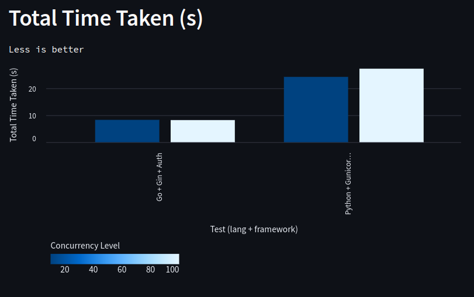

# API_Bench
A Simple Benchmark using Go, Python, Nginx, and Docker.

This test is a study on the Go language and the use of Docker and Nginx. It was conducted in a local environment and serves as an initial demonstration, with further testing needed using different types of responses and monitoring CPU/memory load.


## Results

I separated this section with the analysis of previous data in the file: [previous-benchmarks](previous-benchmarks.md)

Based on the new tests, the following results were obtained, considering the use of Postgres for data persistence. The `/auth/login` route now performs email and password validation and returns a JWT token.


1. **Overall Performance**
Now that authentication is performed with Postgres, there was an impact on overall performance compared to previous tests. The use of the database increases the complexity of operations, which is expected. Even with this addition, the Go + Gin implementation continues to show superior performance, with fast and consistent responses.





2. **Throughput (Requests per Second)**
Go had an average of 120 Requests per Second (RPS), while Python averaged 38.


3. **Time per Request**
In this test, Go performed 68% better than Python.


4. **Request Failures**
Neither Go nor Python had request failures. It is worth noting that the number of requests was reduced to avoid the test running for too long.


5. **Transfer Rate**
Go still leads in terms of data transmission efficiency. The decrease compared to previous tests reflects the increased processing time due to interaction with Postgres.


6. **Response Time Percentiles**
Response time percentiles indicate that Go remains more consistent in handling requests quickly.

**General Conclusions**

This latest analysis reflects the changes when adding a database for persistence and the impact it brings to API performance.


## Contributing

Your contributions are welcome! If you encounter any bugs or have feature requests, please open an issue. To contribute code, follow these steps:

1. Fork the repository.
2. Clone your forked repository to your local machine.
3. Create a new branch (git checkout -b feature-or-bugfix-name).
4. Make your changes and commit them (git commit -m "Description of your changes").
5. Push your branch to your forked repository (git push origin feature-or-bugfix-name).
6. Open a pull request with a clear description of your changes.

## Installation

### Docker

To install Docker

```bash
curl -fsSl https://get.docker.com | bash
```

### ab - Apache HTTP server benchmarking tool

Apache ab [docs](https://httpd.apache.org/docs/current/programs/ab.html)

```bash
apt install apache2-utils
```

### Streamlit analysis (optional)

To install Streamlit for viewing the charts:

Navigate to the /analysis/ directory, then run:

```bash
apt install -y python3 python3-pip python3-venv

python3 -m venv venv

source venv/bin/activate

pip install -r requirements.txt

streamlit run app.py
```

The analysis/tests/comparison.csv file needs to be filled in manually.


## Running 

### Starting the servers

Navigate to the src/ directory.

For the first time:
```bash
sudo docker compose up --build
```

if you already have the Go and Python containers built:
```bash
sudo docker compose up
```

### Run the Benchmark test

Basic Apache ab commands:

- -n: Number of requests to perform

- -c: Number of multiple requests to make at a time

The tests are performed with this configuration:

- Simple response:

1. -n 100000 -c 100

2. -n 100000 -c 1000

- With authentication:

1. -n 1000 -c 10

2. -n 1000 -c 100


Example:

- Golang (show results in the terminal)
```bash
ab -n 100000 -c 100 http://localhost:8080/ 
```

- Golang (save results to a file)
```bash
ab -n 100000 -c 1000 http://localhost:8080/ >> Go_test.txt
```