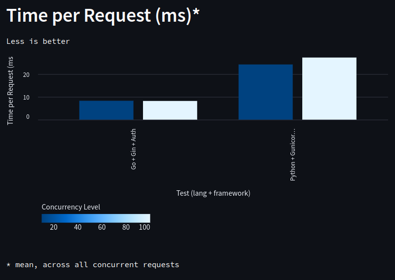

# Previous Benchmarks

## Results - 09/06/2024

I separated this section with the analysis of previous data in the file: [previous-benchmarks](previous-benchmarks.md)

Based on the new tests, the following results were obtained, considering the use of Postgres for data persistence. The `/auth/login` route now performs email and password validation and returns a JWT token.

1. **Overall Performance**
Now that authentication is performed with Postgres, there was an impact on overall performance compared to previous tests. The use of the database increases the complexity of operations, which is expected. Even with this addition, the Go + Gin implementation continues to show superior performance, with fast and consistent responses.

2. **Throughput (Requests per Second)**
Go had an average of 120 Requests per Second (RPS), while Python averaged 38.

3. **Time per Request**
In this test, Go performed 68% better than Python.

4. **Request Failures**
Neither Go nor Python had request failures. It is worth noting that the number of requests was reduced to avoid the test running for too long.

5. **Transfer Rate**
Go still leads in terms of data transmission efficiency. The decrease compared to previous tests reflects the increased processing time due to interaction with Postgres.

6. **Response Time Percentiles**
Response time percentiles indicate that Go remains more consistent in handling requests quickly.

**General Conclusions**

This latest analysis reflects the changes when adding a database for persistence and the impact it brings to API performance.

## Results - 09/03/2024

Based on the data provided, we can draw the following conclusions regarding the performance of different frameworks and configurations:

1. **Overall Performance**
Go (net/http) and Go + Chi demonstrate high performance, with a high number of requests per second (RPS) and fast response times. Python + Flask shows the poorest performance, with an RPS 80% lower than Go and 93.22% request failures under heavy load. Python + Gunicorn + Flask significantly improves performance, approaching Go in high concurrency scenarios.

2. **Throughput (Requests per Second)**
Go + Chi achieves the highest RPS with 100 concurrent requests. Gunicorn enhances RPS in Python, but Go still leads. At higher concurrency levels (1000), Go remains robust, while Python with Gunicorn gets closer.

3. **Time per Request**
Go, with both net/http and Chi, maintains consistently low response times, indicating greater efficiency. Python without Gunicorn has high response times, while Python + Gunicorn significantly reduces these times, though still trailing behind Go in low concurrency and approaching in high concurrency.

4. **Request Failures**
Go shows few or no request failures, even under heavy load. Python + Flask has a high number of failures at high concurrency, indicating low scalability without Gunicorn.

5. **Transfer Rate**
Go leads in transfer rate, showing higher efficiency in data transmission. Python + Flask again underperforms, with some improvement when using Gunicorn.

6. **Response Time Percentiles**
Go and Go + Chi have low and consistent percentiles, indicating quick responses. Python + Flask without Gunicorn has high percentiles, indicating variability and significant slowdowns under load. Python + Gunicorn improves this but still shows outliers compared to Go.

**General Conclusions**
Go is superior in terms of performance, scalability, and reliability, handling high concurrency well. Python + Flask without Gunicorn is not suitable for high loads, but the introduction of Gunicorn improves performance. Go is ideal for critical applications that require high performance, while Python + Flask + Gunicorn is more suitable for less demanding scenarios. These tests were conducted in a local environment and serve as an initial demonstration, with further testing needed using different types of responses and monitoring CPU/memory load.